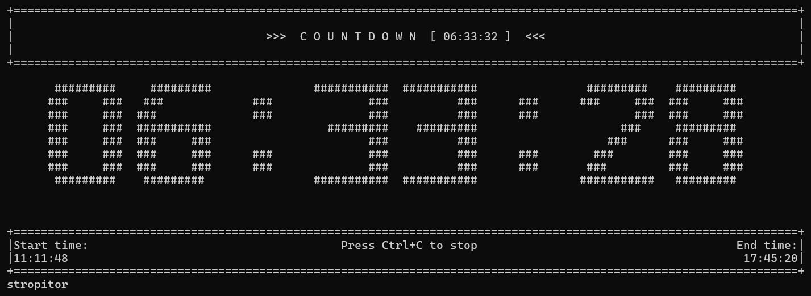

# wincountdown

A command-line countdown timer for Windows with ASCII art display, customizable alerts, and configuration file support.


## Features

- Large ASCII art countdown display with customizable digit styles
- Real-time start and end time display
- Customizable beep alerts (frequency, duration, count, gap)
- Configuration file for persistent settings
- Advanced behaviors: auto-run commands, default flags
- Loop mode for repeating countdowns
- Silent mode option
- Metric time mode (1 hour = 100 minutes, 1 minute = 100 seconds)
- Smart display (shows only relevant time units)
- Debug mode for troubleshooting

## Usage
```bash
wincountdown <time> [options]
```

### Time Formats

- Seconds only: `30s`, `90s`, `500s`
- Minutes only: `5m`, `45m`, `240m`
- Hours only: `2h`, `10h`
- Combined: `1h30m`, `2h15m30s`, `45m30s`
- Colon format: `1:30:00` (HH:MM:SS), `45:30` (MM:SS)

### Options

| Option | Description |
|--------|-------------|
| `-s, --silent` | Silent mode (no beep alert) |
| `-f HZ, --freq HZ` | Beep frequency in Hz (default: from config, or 800) |
| `-b N, --beeps N` | Number of beeps when finished (default: from config, or 3) |
| `-d MS, --duration MS` | Duration of each beep in milliseconds (default: from config, or 1000) |
| `-g MS, --gap MS` | Gap between beeps in milliseconds (default: from config, or 300) |
| `-l, --loop` | Automatically restart countdown when it reaches 0 |
| `-m, --metric` | Display in metric time (1h=100m, 1m=100s) |
| `-h, --help` | Show help message |

### Examples
```bash
# Basic countdowns
wincountdown 30s
wincountdown 5m
wincountdown 1h30m
wincountdown 90s

# Silent mode
wincountdown 10m --silent
wincountdown 5m -s

# Loop mode
wincountdown 25m --loop
wincountdown 3m -l

# Custom beep patterns
wincountdown 1m --freq 440
wincountdown 30s --beeps 5
wincountdown 1h --duration 500
wincountdown 5m --gap 100
wincountdown 1m -f 880 -b 3 -d 200 -g 100

# Metric time
wincountdown 5m --metric
wincountdown 1h -m

# Combinations
wincountdown 25m -l -s
wincountdown 10s -f 1000 -b 1 -d 2000
```

## Configuration File

`wincountdown-config.json` is automatically created on first run in the same directory as the executable.

### Basic Settings

```json
{
  "debug_mode": false,
  "default_frequency": 800,
  "default_beeps": 3,
  "default_duration": 1000,
  "default_gap": 300,
  "default_silent": false,
  "default_loop": false,
  "default_metric": false
}
```

### ASCII Art Customization

Digits (0-9) and colon (:) can be customized in the `ascii_digits` section.

**Requirements:**
- Each digit must be exactly 8 lines tall
- All digits should have consistent width (11 characters recommended)
- Any characters can be used: `#`, `*`, `@`, `█`, `░`, `▓`, etc.

**Example - Default style:**
```json
{
  "ascii_digits": {
    "0": [
      " ######### ",
      "###     ###",
      "###     ###",
      "###     ###",
      "###     ###",
      "###     ###",
      "###     ###",
      " ######### "
    ],
    "1": [
      "    ###    ",
      "  #####    ",
      "    ###    ",
      "    ###    ",
      "    ###    ",
      "    ###    ",
      "    ###    ",
      "###########"
    ]
  }
}
```

**Example - Block style:**
```json
{
  "ascii_digits": {
    "0": [
      " █████████ ",
      "███     ███",
      "███     ███",
      "███     ███",
      "███     ███",
      "███     ███",
      "███     ███",
      " █████████ "
    ]
  }
}
```

If a digit is malformed or missing, the default style is used automatically.

### Advanced Behaviors

#### No Arguments Behavior

Controls behavior when running `wincountdown` with no arguments.

```json
{
  "enable_no_args_default": true,
  "no_args_default_command": "25m"
}
```

Options for `no_args_default_command`:
- `"help"` - Show help screen (default)
- Any time string: `"5m"`, `"25m"`, `"1h30m"`
- With flags: `"10m -l"` (10-minute looping timer)

#### Time-Only Arguments Behavior

Automatically adds flags when only a time argument is provided.

```json
{
  "enable_time_only_defaults": true,
  "time_only_default_flags": ["-l", "-s"]
}
```

Common flag combinations:
- `["-l", "-s"]` - Loop and silent
- `["-l"]` - Loop only
- `["-f", "1000", "-b", "5"]` - Custom frequency and beep count
- `["-m"]` - Metric mode

Note: This only applies when providing just the time. Manual flags disable these defaults.

### Configuration Examples

**Pomodoro Timer:**
```json
{
  "enable_no_args_default": true,
  "no_args_default_command": "25m",
  "enable_time_only_defaults": true,
  "time_only_default_flags": ["-l"]
}
```

**Silent Work Timer:**
```json
{
  "default_silent": true,
  "default_loop": true
}
```

**Custom Alert:**
```json
{
  "enable_no_args_default": true,
  "no_args_default_command": "5m -f 1000 -b 5"
}
```

## Debug Mode

Debug mode can be enabled in the configuration file:

```json
{
  "debug_mode": true
}
```

When enabled:
- Creates `wincountdown-debug.log` in the same directory
- Logs detailed execution information with timestamps
- Clears the log file on each run

## Building from Source
```bash
pip install pyinstaller
pyinstaller --onefile --name wincountdown wincountdown.py
```

The executable will be in the `dist/` folder.

## Installation & Running

### Option 1: Run Python Script

Requirements: Python 3.8+
```bash
git clone https://github.com/Stropitor/wincountdown-cli
cd wincountdown
python wincountdown.py 5m
```

### Option 2: Run Executable (Command Prompt)

```cmd
wincountdown 5m
```

### Option 3: Run Executable (PowerShell)

```powershell
.\wincountdown 5m
```

### Option 4: Add to PATH

1. Copy `wincountdown.exe` to a permanent location (e.g., `C:\Tools\wincountdown\`)
2. Open System Properties → Environment Variables
3. Under "User variables" or "System variables", find `Path` and click Edit
4. Click New and add the folder path
5. Click OK to save
6. Restart the terminal

## Notes

- Maximum time: 99:59:59 (or 99:99:99 in metric mode)
- Timer automatically shows only relevant units (seconds, MM:SS, or HH:MM:SS)
- Start time and end time are displayed at the bottom
- Beep alert plays when countdown finishes
- Loop mode plays only one beep before restarting
- Metric mode: 1 hour = 100 minutes, 1 minute = 100 seconds. Each metric second = 1 real second. Input time is in real time.
- Press Ctrl+C to stop the timer
- Configuration file is created automatically on first run
- Command-line flags override config file settings
- Config file location: Same directory as the script/executable
- ASCII art digits can be customized in the config file

## Troubleshooting

**Config not working:**
1. Enable debug mode (set `"debug_mode": true`)
2. Check `wincountdown-debug.log` for errors
3. Verify `wincountdown-config.json` is valid JSON
4. Delete the config file to regenerate with defaults

**ASCII art looks wrong:**
- Each digit must be exactly 8 lines tall
- All digits should have consistent width
- All lines in a digit should have the same character width
- Invalid digits automatically fall back to default style
- Delete the config file to regenerate with defaults

**Timer not visible:**
- Terminal window must be at least 120 characters wide
- Maximize the terminal window

**No sound:**
- Check that `"default_silent": false` in config
- Verify system volume is not muted
- Try a different frequency with `-f` flag

**Debug log not created:**
- Ensure `"debug_mode": true` is set in the config file
- Check write permissions in the directory
- Log file is created in the same folder as the script/executable

**Unicode characters not displaying:**
- Terminal must support Unicode (Windows Terminal recommended)
- Config file must be saved as UTF-8 encoding
- Try simpler ASCII characters if Unicode blocks don't display